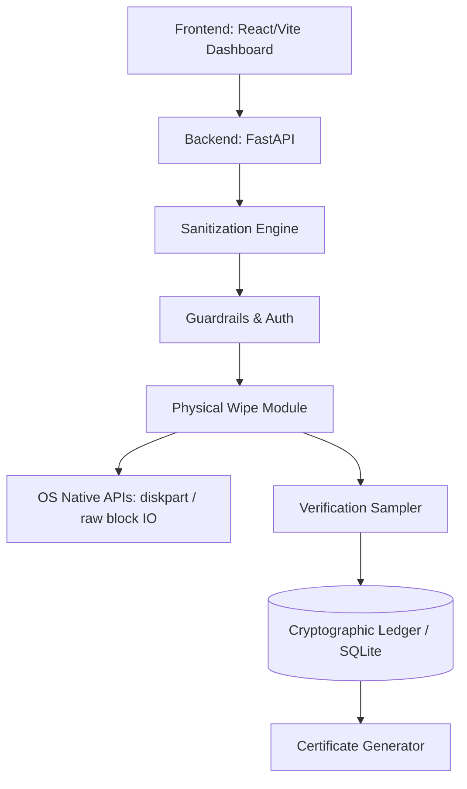
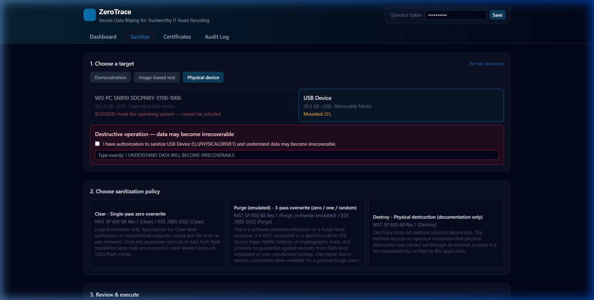

# ZeroTrace

**OPCODE IMPACT 2026 | Hackathon Submission**

**Team ID:** [Enter Team ID]

## 1. Problem Statement
When organizations decommission or recycle IT assets (HDDs, SSDs, USBs), they must ensure that sensitive data is permanently destroyed to prevent data breaches. Existing solutions often lack transparent, cryptographically verifiable audit trails, are difficult to use, or fail to safely handle modern storage constraints like OS-level auto-mounting.

## 2. Solution Title
ZeroTrace

## 3. Solution Description
ZeroTrace is a production-ready, secure data sanitization dashboard that provides NIST SP 800-88 and IEEE 2883-2022 compliant data wiping. It safely handles raw block-device overwrites with built-in protections (like auto-unmounting physical drives via OS-native commands), performs block-level verification sampling, and logs every step into an immutable cryptographic ledger. It ultimately generates verifiable PDF certificates of destruction for compliance auditing.

## 4. Architecture Diagram




The workflow begins with the React frontend sending an operation request to the FastAPI backend. The Sanitization Engine runs pre-flight checks, auto-unmounts the target drive using OS native tools, and executes raw block-level overwrite passes (Clear/Purge). It then verifies the wipe by sampling disk sectors. Every state change and verification result is hashed and appended to a tamper-evident SQLite ledger, which is used to issue PDF certificates.

## 5. Technology Stack
- **Frontend:** React, TypeScript, Tailwind CSS, Vite
- **Backend:** Python, FastAPI, SQLAlchemy, PyInstaller (for packaging)
- **Database:** SQLite (with a custom append-only cryptographic ledger)
- **Other Technologies:** OS Native APIs (`diskpart` on Windows, `umount` on Linux) for low-level block storage management.

## 6. Quick Start Guide
**Prerequisites:** 
- Node.js (for frontend development)
- Python 3.10+ (for backend)
- **Administrator / Root privileges** (required for physical device wiping)

**Installation & Execution:**
```bash
# 1. Clone the repository
git clone https://github.com/hems06/ZeroTrace.git
cd ZeroTrace

# 2. Build the frontend
cd frontend
npm install
npm run build
xcopy /E /Y /I "dist\*" "..\backend\frontend_dist\"

# 3. Setup the backend
cd ../backend
python -m venv .venv
.venv\Scripts\activate
pip install -r requirements.txt

# 4. Run the application (MUST be run as Administrator/Root)
python launcher.py
# The application will automatically open in your default browser at http://127.0.0.1:8000
```

## 7. Output Screenshots


The dashboard displaying a completed physical device sanitization. It shows the selected 3-pass overwrite method, the successful auto-unmounting of the disk, the exact number of bytes written to the raw block device, and the post-wipe verification sampling results.

## 8. Future Scope
- **Hardware-Level Wipe Integration:** Implement native NVMe Sanitize and ATA Secure Erase commands via low-level IOCTLs for SSDs to bypass wear-leveling translation layers.
- **Enterprise SSO:** Integrate SAML/OIDC for enterprise-grade operator authentication and role-based access control.
- **Multi-Device Concurrent Wiping:** Add support for running wiping operations on multiple physical devices simultaneously using background task workers.

## 9. Team Contributions
| Member Name | Contribution |
|-------------|--------------|
| Hema C | Architecture design, frontend development, and core backend sanitization logic. |
| AI Agent | Assisted in debugging raw Windows disk I/O, implementing auto-unmount logic, and packaging. |

## 10. Tools Used
| Tool / Platform | Purpose / Why Used |
|-----------------|--------------------|
| FastAPI & React | Rapid development of a robust backend API and a responsive, modern user interface. |
| Antigravity AI | Used as an AI pair programmer to assist with complex low-level Windows disk I/O permissions and debugging the physical wipe loops. |
| SQLite | Lightweight, file-based database ideal for maintaining an immutable local audit ledger without requiring external database servers. |
